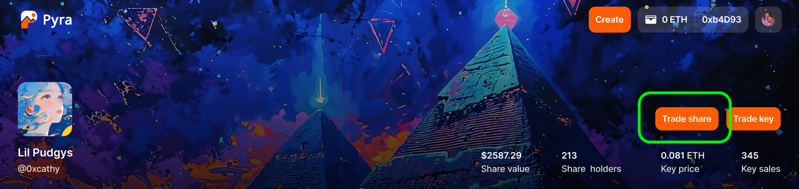

# Buying and Selling Shares

On Pyra, investors and fans can trade a creator by buying and selling shares of them. The value of a creator's shares is determined by the market and can go up or down based on a bonding curve. Creators can earn trading fees every time their shares are bought and sold.

<figure><figcaption></figcaption></figure>

## How to trade shares

1. Visit a creator's page. On the right side of the banner, you will see a `Trade Share` button. Share value and holders number are displayed below.
2. Click the `Trade Share` button. A dialog will pop up. 
3. **Buy** - Select `Buy` in the top bar. Enter the amount you want to buy, share price and total cost will be calculated automatically based on how many are currently circulating. You can buy as many shares as you want.
Click the Buy button and confirm the transaction in your wallet.
1. **Sell** - Select `Sell` in the top bar. Enter the amount you want to sell, share price and total cost will be calculated automatically based on how many are currently circulating. You can sell any quantities of free shares, free shares are shares that are not [staked](./staking-and-revenue.md).

## Trading fees

Trading fees are charged on every buy and sell transaction. The total fee is 12% of the transaction amount, which is split between creator, platform treasury and an independent [revenue pool](./staking-and-revenue.md) shared by all shareholders.
