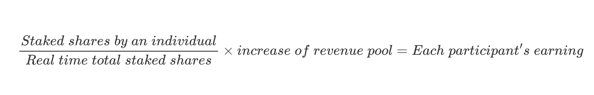

# Staking and Revenue

Profit generated by keys' sales will be distributed to creators and shareholders. The sharing rules are established around a revenue pool.

## Revenue Pool

The revenue pool is a smart contract that collects all the profit generated by keys' sales. The revenue pool will distribute the profit to creators and shareholders according to the following rules:
- 20% of the profit will be distributed to the creator.
- 80% of the profit will be distributed to shareholders.
- The profit will be distributed proportionally to the number of shares staked by each shareholder.

## Staking rules
- Shareholders can stake any amount of their shares.
- Staked shares will be locked in the revenue pool contract and cannot be traded.
- Shareholders can unstake their shares at any time.
- Shareholders can claim their revenue at any time.
- Once you staked your shares, you will start earning from revenue pool's incoming profits.
  
The income distribution of each user will be roughly calculated as:

<figure><figcaption></figcaption></figure>
